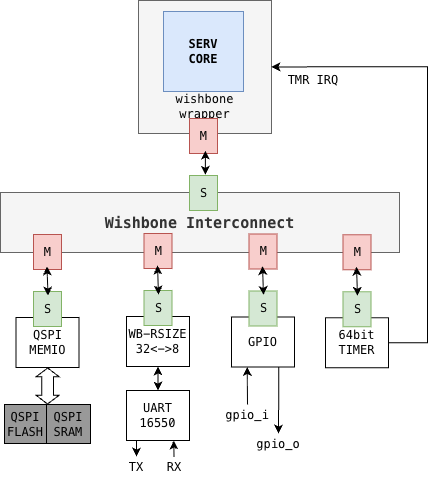

<!---

This file is used to generate your project datasheet. Please fill in the information below and delete any unused
sections.

You can also include images in this folder and reference them in the markdown. Each image must be less than
512 kb in size, and the combined size of all images must be less than 1 MB.
-->

## How it works

### RISC-V SoC based on the SERV

This is a RISC-V SoC based on the SERV and SERVILE cores from [https://github.com/olofk/serv.git](https://github.com/olofk/serv.git). The SERV core has been adapted to support the RV32E specifications. The register file was implemented via an DFF-based SRAM of 19x32 bit, 15 General Purpose Registers (GPR) and 4 CSR. 

The SoC is composed of a [SERV](https://github.com/olofk/serv.git) core, a [GPIO](https://github.com/open-design/riscv-soc-cores/tree/master/cores/gpio), an [UART](https://github.com/olofk/uart16550) a 64-bit timer and a [QSPI](https://github.com/by17s/RISCV-KianV-BareMetalStyle/blob/main/src/qqspi.v) controller. All components are interconected via a wishbone bus interconect. The QSPI controller allows the SoC to access an external QSPI FLASH and RAM memories using the [QSPI Pmod](https://github.com/mole99/qspi-pmod/tree/main) board. 

The following diagram ilustrates the main system interconection. 




### Memory Map

|||
|-|-|
|Peripheral| Address|
|QSPI-FLASH| 0x00000000 - 0x00FFFFFF|
|QSPI-RAM1 | 0x01000000 - 0x017FFFFF|
|QSPI-RAM2 | 0x01800000 - 0x01FFFFFF|
|UART-16550| 0x90000000 - 0x90000007|
|GPIO      | 0x91000000 - 0x9100001F|
|MTIMEL    | 0xFFFFFFF0 - 0xFFFFFFF3|
|MTIMEH    | 0xFFFFFFF4 - 0xFFFFFFF7|
|MTIMECMPL | 0xFFFFFFF8 - 0xFFFFFFFB|
|MTIMECMPH | 0xFFFFFFFC - 0xFFFFFFFF|

NOTE: The whole system works maximum at 25Mhz on gf180mcu and 50MHz on sky130A. 

It is worth mentioning that the SoC can execute code from both FLASH and SRAM memories, the execution from SRAM is posible thanks to an small bootloader loaded in flash that recives the program from the uart and dumps it into the SRAM. 

### Pinout interface

The following is the pinout on the tinty tapeout chip: 

The gpio_o can be connected to any type of putput, LEDs, LCDs, etc and the gpio_i can be connected to any kind of input, buttons, sensors etc.

The uart must be connected to the pc via an usb-serial converter (e.g., rs232rl or similar) .

||||
|-|-|-|
|tt-io| direction | SoC pinout
|clk|input  |clk|
|rst_n|input  |rst_n|
|ui[7:0]|input  |gpio_i[7:0]|
|uo[7:0]|output |gpio_o[7:0]|
|uio[0]|output |cs_flash|
|uio[1]|inout  |sio0|
|uio[2]|inout  |sio1|
|uio[3]|output |sck|
|uio[4]|output |uart0_tx|
|uio[5]|input  |uart0_rx|
|uio[6]|output |cs_ram0|
|uio[7]|output |cs_ram1|


## How to test

### Install the RISC-V toolchain with RV32E support

#### 1. Prerequisites on Ubuntu

```bash
#using bash
sudo apt-get install autoconf automake autotools-dev curl python3 python3-pip python3-tomli libmpc-dev libmpfr-dev libgmp-dev gawk build-essential bison flex texinfo gperf libtool patchutils bc zlib1g-dev libexpat-dev ninja-build git cmake libglib2.0-dev libslirp-dev libncurses-dev
```

#### 2. Prerequisites on MacOS

```bash
# using homebrew
brew install python3 gawk gnu-sed make gmp mpfr libmpc isl zlib expat texinfo flock libslirp ncurses ninja bison m4 wget
```

#### 3. Configure and compile the crosscompiler for RV32E:
```bash
git clone --recursive https://github.com/riscv/riscv-gnu-toolchain.git
cd riscv-gnu-toolchain
mkdir -p /opt/riscv32e
./configure --prefix=/opt/riscv32e --with-arch=rv32e --with-abi=ilp32e
make -j$(nproc)
export PATH=/opt/riscv32e/bin:$PATH
```

### Run Examples

1. Flash the nmon bootloader: 

    - Program the flash memory using the [nmon_25MHz.bin](../sw/0-riscv-nmon/nmon_25MHz.bin) bootloader, this step is required to be done only once. You can use any FLASH programer (e.g., serprog).

2. Compile the program
    ```bash
    cd ./sw/1-blink_led
    make clean build nmon
    ```
3. Program the SERV-E-SoC with the compiled application
    ```bash
    # check the actual USB port in your system
    expect nmon-loader.sh application.nmon /dev/ttyUSB0 115200
    ```

The following is a set of basic examples that have been prepared to use the SERV-E SoC. Every example has details about how to compile and program on the SERV-E- SoC.

[0-ricv-nmon](../sw/0-riscv-nmon/): This is a basic bootloader living in the flash memory, it can be used to dump a program into de SRAM comming from the uart port.

[1-blink_led](../sw/1-blink_led/): Basic blink led.

[2-gpio_echo](../sw/2-gpio_echo/): Simple GPIO echo, copies inputs and put it to the outputs.

[3-uart_stub_1](../sw/3-uart_stub_1/): Uses the nmon uar function to access the uart.

[4-uart_stub_2](../sw/4-uart_stub_2/): Uses the nmon uar function to access the uart.

[5-uart_puts](../sw/5-uart_puts/): Explicit uart driver implementation, just transmision from SoC to PC.

[6-uart_getc](../sw/6-uart_getc/): Explicit uart driver implementation RX/TX.

[7-systmr-irq](../sw/7-systmr-irq/): Timer IRQ implementation example.

[8-FreeRTOS-demo1](../sw/8-FreeRTOS-demo1/): Simple FreeRTOS port for the SoC.

[9-FreeRTOS-demo2](../sw/9-FreeRTOS-demo2/): Simple FreeRTOS port for the SoC.


## External hardware

This project requires an external SPI Flash/Ram memory. The project ahs been proven using [QPMOD](https://github.com/mole99/qspi-pmod/tree/main). You also need to connect an USB to Serial conversor to interact with the system. 